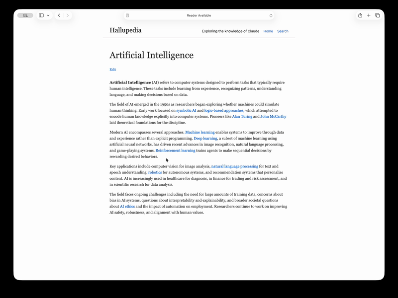
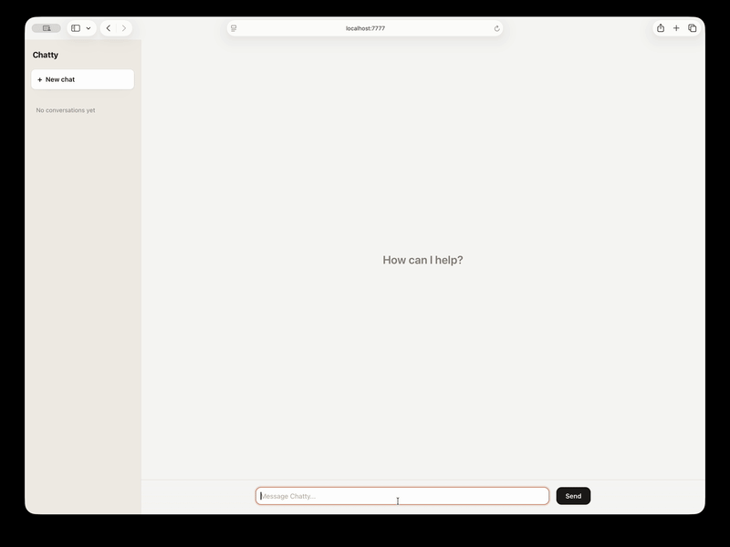

# Hallu: this web app does not exist

<p>
  
  &nbsp;
  
</p>

**Hallu is a web framework where an LLM hallucinates your entire app.**

With Hallu, you've already shipped features you never even thought of. It's an agent harness that takes a request and acts like a web app against a real database. It's the "interpreter" to Claude Code's "compiler": Application logic is generated at runtime instead of at build time. Think per-request (proofless) program synthesis against an informal prose spec.

Every request routes to a model with a SQL tool and instructions to return html. The model is the controller, the ORM, and the template engine.

Point one of the examples to Haiku and click around to watch a working app assemble itself one feature at a time.

Don't just have Claude write your app. Have Claude **be** your app.

## How it works

Runs on Bun + Hono. Uses SQLite by default, supports Postgres. Bring your own model.

### One catch-all route
`GET /*` asks the model for the page body. A client runtime intercepts form submits and POSTs them to `/__hallu/action`.

### One tool
The model reads and writes the database through a single `sql` tool in a loop.

### Wire format
Actions stream back `<hallu-update target="id">...</hallu-update>` blocks. The client swaps each region in by id. It feels like an SPA.

### Streaming
With `streamResponses`, an action streams into a container through a `stream` tool. The framework appends your wrapper markup, fills it as tokens arrive, and fires a `hallu:finalize` event at the end. Two modes: literal text by default (markup escaped), or `html: true` to render the stream as live HTML as the tokens land.

### Page chat
With `pageChat`, a floating panel lets the user revise the current page by instruction. The framework posts the page and instruction to `/__hallu/revise` and the model rewrites it in place. The edit is saved by path glob and re-applied on every later render of a matching page, so it sticks.

### Caching
Rendered pages are cached per path so warm loads skip the model. A DB write invalidates affected pages (coarse by default, or scoped with a glob).

### Two schema modes
Fixed (`tables` is the whole schema) or `autoSchema` (the model creates tables on the fly for paths it hasn't seen)

#### autoSchema mode
The schema grows as you browse. Visit a path for the first time and the model will design a table, create it, and render the page to html. Add `/new` to the path, and the model will generate a form. Submit the form and the model will insert the record and render the page. Add `/delete` to the path, and the model will present you with an "Are you sure?" form and then delete the record, as requested.

#### tables mode
Pin the schema yourself. Declare your tables in the config and the framework creates them on boot. The model reads and writes only within them and never runs DDL, so the shape of your data is fixed and known.


## Examples

<p>
  
</p>

### Hallupedia
A "real world" encyclopedia. Every article is generated on-demand from the model's knowledge graph, and the same model generates the SQL and html.

### Slop Overflow
A programmer Q&A site on Postgres, hybrid autoSchema and declared tables.

### Chatty
A ChatGPT-style chat app on `streamResponses`. The model streams html token-by-token into the thread.

### Salesfarce
A schema-less CRM. Visit an object and the model designs and creates its table and seeds it.

### Shamazon
A store where the whole catalog is invented on demand: products, prices, reviews, then saved so the page is stable on return.

### NeuroMUD
A Neuromancer-themed MUD.


## Get started

Requires [Bun](https://bun.sh) (`curl -fsSL https://bun.sh/install | bash`).

```bash
bunx hallujs generate myapp   # defaults: Anthropic + SQLite
cd myapp && bun install
echo "ANTHROPIC_API_KEY=sk-ant-..." > .env
bun dev
```

`generate` takes flags for the backend and provider: `--postgres`, and `--anthropic` (default) / `--openai` / `--ollama`.


## Configuration

`hallu.config.ts` default-exports `defineConfig({...})`. Required: `name`, `description`, `model`.

| Option | Type | Default | |
| --- | --- | --- | --- |
| `name` | `string` |  | App name; document `<title>`. |
| `description` | `string` |  | The domain, data, and rules in prose. |
| `model` | `LanguageModel` |  | Any AI SDK model, e.g. `anthropic("claude-opus-4-8")`. |
| `providerOptions` | `ProviderOptions` |  | Provider-specific request options forwarded on every call, keyed by provider id (e.g. reasoning/thinking). |
| `streamResponses` | `{ container, wrapper, html? }` |  | Let an action stream text token-by-token into `container`, wrapped in `wrapper`. `html: true` renders the stream as live HTML instead of literal text. Fires `hallu:finalize` when done. |
| `tools` | `(ctx) => ToolSet` |  | Extra model tools alongside the built-in `sql`/`stream`. A factory per request; a tool's `execute` reads/writes via `ctx.sql`. |
| `tables` | `Record<string, Record<string, string>>` | `{}` | Schema as `{ table: { column: "<sql type>" } }`, created on boot. |
| `autoSchema` | `boolean` | `false` | Let the model `CREATE` tables/FKs on the fly; else DDL is forbidden. |
| `addFields` | `boolean` | `false` | "Add field" control that runs `ALTER TABLE ADD COLUMN`. |
| `pageChat` | `boolean` | `false` | Floating panel to revise the current page by instruction; the model rewrites it in place and the edit is cached. |
| `design` | `string` |  | CSS guidance for the model (class names, Tailwind, ...). |
| `head` | `string` |  | Raw HTML injected into `<head>`. |
| `static` | `string` |  | Directory served at web root. |
| `busyIndicator` | `boolean` | `true` | Use the default loading CSS (top progress bar + content dim) during an action or style `hallu-busy`/`hallu-patched` yourself. |
| `navLinks` | `boolean` | `false` | Have the model render a nav menu of related links. |
| `indexPrompt` | `string` |  | Extra render instructions for `/` only. |
| `routes` | `string[]` | allow all | Allowed path globs (`*`/`**`). If set, non-matching paths get a 404 |
| `cacheHtml` | `boolean` | `true` | Serve cached page HTML. |
| `cacheTemplate` | `boolean` | `false` | Cache a per-shape template, re-render against live data. Overrides `cacheHtml`. |
| `invalidateOnWrite` | `string[]` | drop all | Globs of pages to drop on write; else every page drops. |
| `identify` | `(c) => Tenant \| null` | single-tenant | Resolve the account for a request; DB + cache key per account. |
| `loginPath` | `string` | `401` | Redirect path when `identify` returns null. |
| `configure` | `(app: Hono) => void` |  | Mount your own routes before the catch-all. |
| `temperature` | `number` | `0.35` | Sampling temperature. |
| `maxSteps` | `number` | `8` | Max tool-loop steps per render/action before the framework gives up. |
| `port` | `number` | env `PORT` / `7777` | Listen port |
| `logLevel` | `"debug" \| "info" \| "silent"` | `"debug"` | `debug` logs every SQL statement. |
| `onSql` | `(e: SqlEvent) => void` |  | Called after each `sql` execution. |
| `database` | sqlite or postgres | sqlite | `{ driver: "sqlite", path?, dir? }` or `{ driver: "postgres", url, schema? }`. |
| `seed` | `(db) => void` |  | Run once when a DB/schema is first created. |
| `afterWrite` | `(db, events) => void` |  | Called after every write |

`Tenant` is `{ account, context? }`

`SqlEvent` is `{ query, ok, mutated, error? }`

SQLite `path` defaults to `./hallu.db` (per-account files under `dir`, `./data`)

Postgres `schema` defaults to `public`.

## Caveats

- It's slow: A page is a model call, sometimes several. Pages take ~2s to load on Haiku. It's a website powered by a tool calling LLM though. What'd you expect?
- It costs tokens: Every cold request hits the model. There's a cache, so it's not insane, and Haiku is relatively cheap and does the job perfectly.
- It's non-deterministic: The same URL renders slightly differently on every cold load and cache invalidation.
- The security model isn't perfect: The framework passes untrusted input to an LLM and asks it to write arbitrary SQL. That's dangerous. There's a script in the repo that tests common SQL-injection techniques. But yeah, it's an LLM hallucinating SQL. Don't use this for anything important.

## Develop

```bash
bun install
bun test        # offline: runs against a stubbed model, fast and deterministic
```
